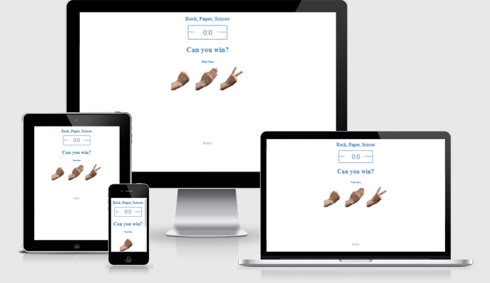
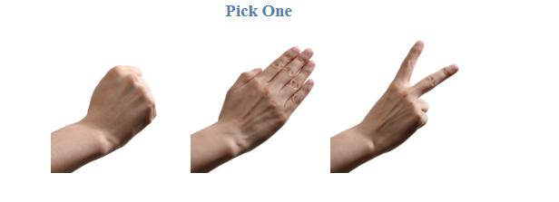
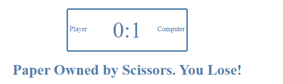
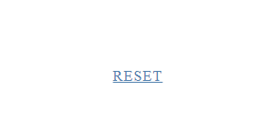
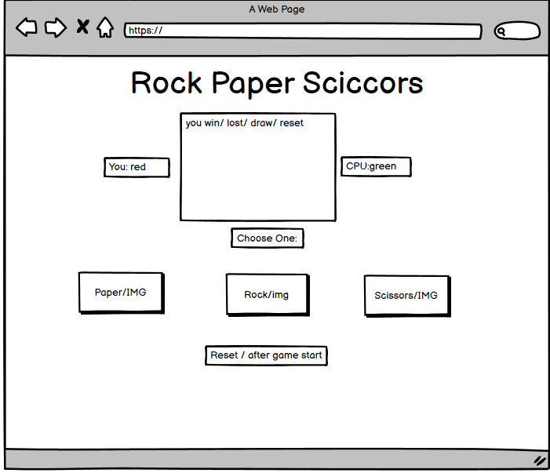
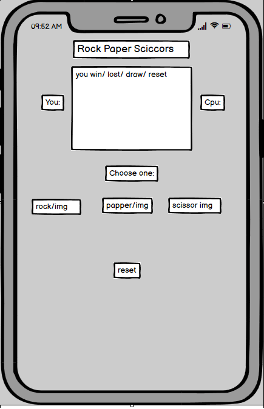
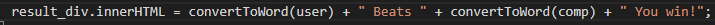

# Rock Paper Scissors
This is a Rock Paper Scissor Game Website that allows you to play against the computer and see how many points you can win.
The choice is yours: Rock, Paper, or Scissors?

Playing this game is really easy, you only have 3 options to choose from,
The game is perfect for all types of players, young and old, because it is extremely easy to play
Wish you luck and see how many points you can score against the computer!

# Features
- __Header__
  * The game name is listed in the header
  * The background is all white with a blue color text

- __The Games options__
  * There are 3 images of stone paper and scissors that you can click on
  * To match the rest of the site, the background is all white
  * It shows exactly what it is in the image

- __The Result/rule__
  * Your table score tells you whether or not you have taken a point
  * There is a text under the score board that tells you what happens if you win, lose, or draw based on your choices
  * You get one point when you win, but the computer gets one if you lose, and if you draw, nobody gets a point

 

- __The Reset Button__
  * You can reset the score and the game by pressing the reset button

   

# Futures implement
  * I want to add time limit and seee how many points you can get

# Typography and color scheme
  * Color: white and blue   

# wireframes
- __wireframes desktop__

- __wireframes phone__

# Technology
- Wireframes for layout on desktop and mobile in Balsamiq tools.
- This site was laid out and structured using HTML.
- Style and appearance using CSS.
- Javascript for game.
- Use Github to deploy the project and read the README.
- Gitpod is used for coding.
- CodeInstuite project, YouTube, and Google for tutorials and troubleshooting.
- Skype for contact with the mentor for tips and advice. 
- jigsaw, W3c and lighthouse for testing and troubleshoot.

# Testing

- I tested this game on Microsoft edge and Chrome and it seems to works great.
- The game is playable on desktops, iPads, and phones when I tested.
- I can confirmed the game is working fine.
- Each rock, paper, and stone button works fine on mobile and desktop
- The reset button works and resets the game and refreshes the site
- I confirmed the games were easy to understand and play

# Bugs
- Didnt get the inner messsage to work was missing a .

- But after google and searching figured out and add the . and everything worked

